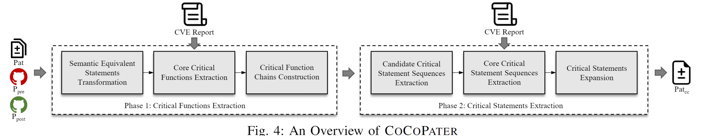

# Copalot
This folder contains the implementation of `Copalot`. The system is organized into three main phases, each playing a critical role in identifying critical changes in vulnerability patches.


## Dependencies

To run this project, you will need the following dependencies:

- **python**: 3.11.8

- **joern**: v4.0.250

  The installation process for Joern can be found at https://docs.joern.io/installation.

- **tree-sitter**: 0.22.6

  The installation process for tree-sitter can be found at https://tree-sitter.github.io/tree-sitter/

- **ctags:** 5.9.0
 
    The installation process for ctags can be found at https://github.com/universal-ctags/ctags.

- **transformers** 4.52.4
- Other relevant dependent packages listed in [requirements.txt](./requirements.txt)

  To setup, just run:

  ```
  pip install -r requirements.txt
  ```

## How to Run
To run this tool, just modify the path of ctags `CTAGS_PATH`, the path of joern `joern_path`, the path of dataset `excel_path` and the api key of GPT-4o `LLM_KEY` in the lines 15-18 of the script `config.py` and run the script `main.py` in the following step:
```
    python main.py
```
The results will be shown in the directory `results_cache`.

## Prototype Structure

### Phase 1: Critical Functions Extraction

Phase 1 implements a "filtering-then-recovering" pipeline to isolate the most relevant functions responsible for the vulnerability fix.  We begin by normalizing each changed file via semantic equivalence transformations, stripping away purely syntactic edits to focus on meaningful changes. Next, we extract three complementary signatures: inter-procedural call graph summaries, intra-procedural statement flow around diff hunks, and vulnerability knowledge (descriptions and CWE) from CVE reports.  These signatures guide a semantic-enhanced LLM in filtering out non-critical functions, producing an initial core set.  To ensure completeness, we recover semantically similar variants using CodeBERT and then expand the set through backward and forward inter-procedural data-dependency analysis powered by Joern.  The result is one or more ordered critical function chains capturing both vulnerable logic and its propagation paths.

#### 1.1 Semantic Equivalent Statements Transformation
In this step, we apply AST-based semantic equivalence transformations using curated patterns (e.g., arithmetic/logical simplifications, loop refactoring, macro expansion) to strip away syntactic noise and retain only meaningful semantic changes. The related file included `code_transformation.py` and `ast_parser.py`. The detailed file structures are:

- `code_transformation.py`
  - `operator_extraction`
  - `del_DeadCode`
  - `while_for_transformation`
  - `move_definition`
  - `split_define_assign`
  - `merge_control_blocks`
  - `split_control_blocks`
  - `del_qualifier`
  - `modify_if_else`
  - `code_transformation`
- `ast_parser.py`
  - `ASTParser`
#### 1.2 Core Critical Functions Extraction
We aggregate inter-procedural call graph signatures, intra-procedural statement flow around diff hunks, and CVE-derived vulnerability knowledge to prompt the LLM for filtering and ranking the core critical functions. The related file included `function_clustering.py`, `vul_pat_cg.py`, `critical_vul_extract.py`, `callgraph_formatted` and `cg_path.py`. The detailed file structures are:

- `function_clustering.py`
  - `export_joern_graph`
  - `get_pre_post_call`
- `trigger_analysis/vul_pat_cg.py`
  - `extract_vuln_functions(desc, cg, pat)`
- `trigger_analysis/critical_vul_extract.py`
  - `find_called_functions(cg, llm_methods)`
  - `filter_call_data(cg, called_methods)`
- `callgraph_formatted.py`
  - `process_graph(graph_part, part_name, target)`
- `cg_path.py`
  - `func_path_extract(trigger_point, modified_point, cache_dir)`

#### 1.3 Critical Function Chains Construction
By encoding F_core functions with CodeBERT to recover semantically similar variants and performing backward/forward data-dependency analysis on Joern-generated PDGs, we build ordered critical function chains that trace vulnerability propagation. The related file included `codebert.py`, `joern.py`, and `function_clustering.py`. The detailed file structures are:
- `codebert.py`
  - `codebert_sim(core_func_list, pre_function_dict, post_function_dict)`
- `joern.py`
  - `export_with_preprocess_and_merge(code_path, output_path, language, overwrite, cdg_need)`
  - `CPG` and `PDG` classes for graph construction and analysis
- `function_clustering.py`
  - Backward and forward inter-procedural data dependency analysis via Joern

### Phase 2: Critical Statements Extraction

Phase 2 drills down inside each critical function chain to identify the atomic statements that enact the vulnerability fix.  We extract fine-grained inter-procedural taint paths for changed variables, merging pre- and post-patch sequences to form candidate statement sequences.  These candidates, together with vulnerability knowledge, are presented to the LLM to filter for core critical statement sequences, honoring the same filtering-then-recovering ethos.  Semantic recovery leverages CodeBERT to include similar sequences, and a monitoring mechanism (static linting or compilation checks) iteratively reintroduces additional statements from the original patch until all compatibility errors are resolved.  The final output is a concise, semantically complete patch aligned with the vulnerability context.

#### 2.1 Candidate Critical Statement Sequences Extraction
For each function chain, we extract backward and forward inter-procedural taint paths for changed variables, merging pre- and post-patch contexts into unified candidate statement sequences. The related file included `taint_analysis.py` and `merge_taint_path.py`. The detailed file structures are:

- `taint_analysis.py`
  - `taint_analysis_all`
  - `mapping_taint_path`
  - `taint_analysis`
- `merge_taint_path.py`
  - `process_string(s)`
  - `merge_string_lists(list1, list2)`

#### 2.2 Core Critical Statement Sequences Extraction
The LLM is guided by vulnerability knowledge and candidate taint sequences to filter and select the top-ranked core critical statement sequences for precise remediation.

- `trigger_analysis/vul_pat_cg.py`
  - `extract_vuln_patch(desc, pat, taint_pats)`

#### 2.3 Critical Statements Expansion
We recover semantic variants of core sequences via CodeBERT and iteratively reintroduce pending statements under a compatibility monitor (static lint or compile checks) until all errors are resolved, yielding the final concise and complete patch.
- `recovery.py`
- - `CodeBERTSimilarity`
  - `CodeMapper(original_code, transformed_code)`
  - `checking_recovery(pa, pb, pc, pC)`
- `get_ccpost.py`
  - `apply_diff_in_memory(repo_path, commit_hash, file_path, diff_path)`